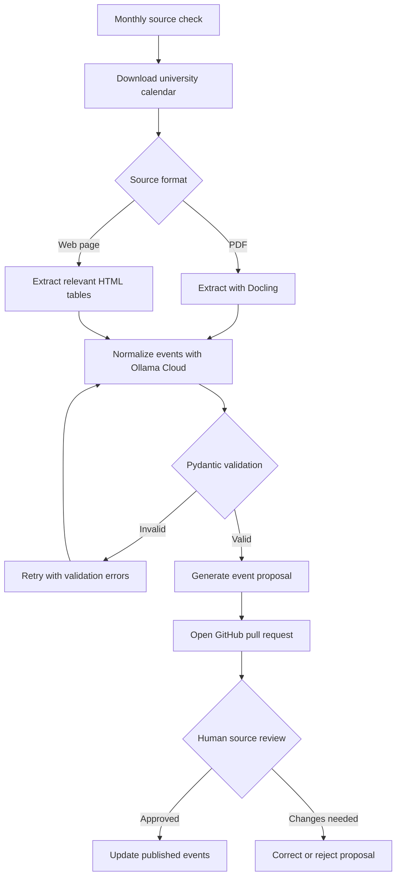

# UniDate

UniDate is an open-source web app for overlaying Malaysian university academic calendars. It helps students compare schedules across universities when planning activities with friends.

## MVP

- UiTM, UniMAP, UUM, UM, and UKM
- Academic sessions 2026/2027 and 2027/2028
- Search, filters, university pages, and combined calendar overlays
- Source links and one-time ICS downloads
- Malay-first, mobile-friendly interface with English support
- Public read-only API without authentication
- Monthly extraction from public university webpages and PDFs
- Human approval of data changes through GitHub pull requests

## Stack

- Next.js frontend in `frontend/`
- FastAPI backend in `backend/`
- Self-hosted LXC containers on Proxmox
- Version-controlled calendar data reviewed through GitHub pull requests

## Run locally

```bash
cd backend
uv sync
uv run uvicorn app.main:app --reload
```

In another terminal:

```bash
cd frontend
pnpm install
pnpm dev
```

Open `http://localhost:3000`. API documentation is available at `http://localhost:8000/docs`.

You can also run both production containers with `docker compose up --build`.

## Data updates

The monthly GitHub workflow downloads registered public sources, uses Docling for PDFs, and sends the structured result to Ollama Cloud. Pydantic-valid complete event proposals are committed to a pull request; they remain unpublished until a maintainer checks them against the linked source and updates `backend/data/events.json`.



In short, automation prepares proposals but never publishes extracted events directly. A maintainer must compare each proposal with its linked university source before it becomes part of the public calendar.

Configure the `OLLAMA_API_KEY` repository secret and the `OLLAMA_MODEL` repository variable before enabling the live workflow. Ollama output is retried up to three times when it is invalid JSON or fails schema/date validation.

Downloaded source files are retained locally under `backend/data/raw/<university>/<academic-session>/` with a metadata JSON file containing the URL and SHA-256 hash. To download sources without creating proposals:

```bash
cd backend
uv run python scripts/sync_calendars.py --download-only
```

To verify extraction without spending Ollama credits or opening a pull request:

```bash
uv run python scripts/sync_calendars.py --extract-only
```

Raw and structured files are stored by university and session under `backend/data/raw/` (gitignored). UUM 2026/2027 is collected directly from its HEA HTML tables; PDFs use Docling only. The older pypdf dependency is retained only in the optional benchmark script, not in the collector.

See [PRD.md](./PRD.md) for the full product requirements.

## Status

MVP implementation in progress. Initial approved data covers available 2026/2027 sources; unavailable university/session combinations remain visible with an empty-state message.
